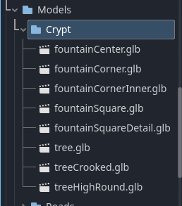
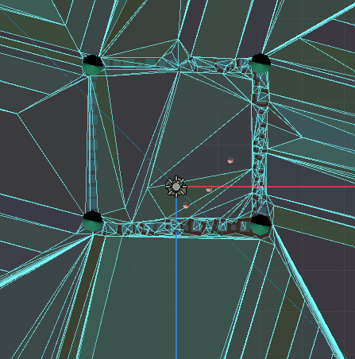

# Entry 5
##### 4/1/24

### Context
For the past month after learning our tool for an entire year, we have been working towards our MVP and have actually finished it. The game we created was a melee battle game where your goal is to kill the enemys that spawns in the world. This game was made using [GoDot](https://godotengine.org/) and it is different then what we initially had in mind. During the time before the due dates of the MVP, we worked hard to put together everything we laerned into a final useable project. In this blog, I discuss my process and what I did for my MVP.

### Progress

while working towards MVP for our goDot project, there were many features and conpoments we had to learn, code and add into our game. For me, I worked on adding a player controller, so that the user can move , jump, sprint and attack using the controls and the map of our game. My partner on the other hand, worked on adding the functionality of the enemy, and creating the weapon the player holds. For the player controller, I imported a premade scene that includes the script but also the object and nodes of the characters. I had to make some adjustments to the script such as changing the speed of movements. I also had to learn how to connect the controls of the player to the scene. In other words, I had to add control names, and set each key on the keyboard (W A S D, space, etc) to the player. Figuring this out was hard since It required me to edit the script and find out where exact I connect the controls. However, by using a tutorial video I was able to follow the steps in importing and setting the keybinds, allowing users to move the player. Moving on, creating the map for the game was way more difficult to understand and do. Not only did I have to figure out how exactly, the map should look, I had to know what assets I want, how to add it into the scene, and making sure the ratio/size of the assets are correct. Instead of creating my own assets, I decided to use kenney which provides premade asset packs that you can directly download and import into your files. When I have choosen a pack, I imported into my files system in goDot, after organizing the files and creating folders for models and assets like shown below:

()

Since, the asset packs has hundreds of models, I had to preview and go through each scene to check whether or not I needed the assets before importing it into goDot. This took a long time, as I had to import each individual scenes into my folders. When I finally finished, I had to outline and create the map by dragging each parts into the scene and organizing it. When I finished with the map, I committed it, and me and shelly worked on the enemy. The enemny was the last part to our MVP, and it was the most difficult thing out of the whole project. We tried to follow tutorial videos and code the enemy so it spawns/moves but we cannot figure it out for a long time. We knew that we needed to create a script, navigation and a scene, but we didnt know how to do it. However, eventually shelly was able to figure it out and managed to spawn three oofable enemies for the user to oof. With that, we completed our MVP like shown below:

()

This is what our godot project look like when you preview it in the engine. It is an 2D version of how our game looks. After completing our project, we we still needed to find a way for us to share the preview to google classroom so we had to learn to export the godot game into a zip file. By doing so, we can import it into [itch.io](https://itch.io/) so that we can preview the game through it and share it to classroom.

### Engineering Design Process
We are currently on steps 6 & 7 of the [Engineering Design Process](https://hstatsep.github.io/students/) which is to test and evualte the protypo and improve as needed. Soon we will share our project with the class to get any feedbacks in order to commincate and further improve our project before the EXPO. Our goal for next few weeks are to improve and add addition stuff to our MVP. 

### Skills
The skills I used for this blog is mainly Collaboration ane Communication. Collaboration is the idea of asking for help and working together with a someone, while communication is the idea of staying in contact with your partner to plan and communicate each of your ideas. For this blog, these two skills were used the most because I had to stay up late with Shelly to finish this project. We also had to ask our classmates like YU for help since we are using the same tool. For example, my partner and I had to collabrate on this project, spliting each task up so that we can each complete our own part. This allowed us to work together to finish this project as we each were responsible for contributing to the MVP. Not to mention, we stayed up together in a discord call to communicate all our ideas, our work and what we have done. As for communication, my partner and I talked and texted each other, communicating our needs and ideas whenever we could. We stayed in touch the whole time, asking each other for help if we have needed it. We also asked for the help of our classmates for certain parts like how to make our enemy moves or how to export our project. Overall during this whole year, we have Collaborated and Communcated with each other in order to complete our MVP. 

### Next Steps
Our next steps are to improve our game and go beyond MVP using our classmates feedbacks to add new features, improve current ones and working towards making our project better for the EXPO. After finishing beyond MVP, we will start preparing for the SEP EXPO, where we share what we have made with everyone. 

[Previous](entry04.md) | [Next](entry06.md)

[Home](../README.md)
